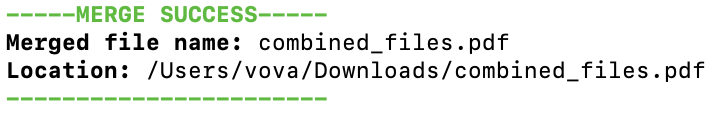

# PDF Merger
I didn't want to deal with signing up on a website for a pdf merger, 
and the last one I used took forever to load and was confusing on how 
to actually download the final product.  So, I made this and integrated 
it in my terminal to simplify the process.

Just running the file will open a window to choose the files to combine.
Then the next window will be where you save the combined file.  The merged
product has the files in the order they were chosen in the first window.

Video for reference usage:

https://github.com/user-attachments/assets/007d4a97-019c-4026-bdd0-7a3a78c2511e

Example Merge Outputs to terminal:

